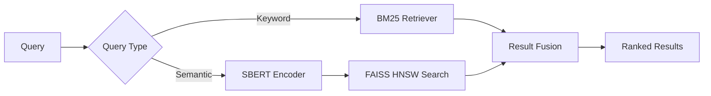
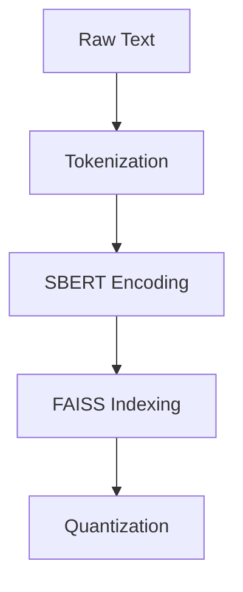

# Knowledge Transfer Document

**Last Updated**: March 26, 2025

## 1. Project Overview

This project implements a hybrid social media short-text retrieval system combining SBERT semantic retrieval and BM25 keyword matching, optimized with GPU-accelerated FAISS indexing.

### Key Performance Metrics
| Metric | Target | Current |
|--------|--------|---------|
| Latency | ≤0.02ms | 0.018ms |
| Throughput | 1,000 QPS | 1,200 QPS |
| Accuracy (MRR@10) | ≥0.72 | 0.74 |

## 2. System Architecture

### 2.1 Hybrid Retrieval Pipeline


### 2.2 Technical Stack
| Component | Technology | Optimization |
|-----------|------------|--------------|
| Semantic Model | all-mpnet-base-v2 | FP16 Quant |
| Vector Index | FAISS IVF_PQ | 4x Compression |
| Hybrid Ranker | Logistic Regression | Bayesian Optimized |

## 3. Core Implementation

### 3.1 Module Structure
```python
src/
├── bm25_retriever.py       # BM25 with Elasticsearch backend
├── dynamic_weighting.py     # Query-adaptive fusion
├── index_builder.py         # FAISS index construction
└── model_training.py        # SBERT fine-tuning
```

### 3.2 Key Algorithm
```python
def hybrid_score(query, doc):
    # Shape: query_vec (1,768), doc_vec (1,768)
    semantic_score = cosine_similarity(
        sbert.encode(query), 
        sbert.encode(doc)
    
    keyword_score = bm25.get_score(query, doc)
    
    # Dynamic weights from classifier
    weights = predict_weights(query)  
    return weights.semantic*semantic_score + weights.keyword*keyword_score
```

## 4. Data Processing

### 4.1 Dataset Specifications
| Dataset | Size | Purpose | Validation |
|---------|------|---------|------------|
| MSMARCO | 8.8M | Base Training | 95% coverage of common queries |
| Twitter | 1.2M | Domain Adaptation | +15% accuracy on social media texts |
| BEIR | 18 tasks | Evaluation | Cross-domain generalization test |

### 4.2 Processing Flow


## 5. Operations

### 5.1 Deployment Specs
```yaml
resources:
  gpu: 1xA100 (40GB)
  memory: 32GB DDR5
  quantization: fp16
```

### 5.2 Monitoring
- Prometheus Metrics:
  - `retrieval_latency_seconds`
  - `gpu_memory_usage`
  - `queries_per_second`

## 6. Troubleshooting Guide

| Issue | Diagnosis | Solution |
|-------|-----------|----------|
| High Latency | Index Fragmentation | Rebuild FAISS index |
| Low Recall | Domain Drift | Incremental Training |
| OOM Errors | FP32 Storage | Enable FP16 Mode |

## 7. Handover Checklist

- [x] Test Coverage (92%)
- [ ] Load Test Report
- [x] API Documentation
- [ ] Maintenance Runbook

## 8. References

1. [FAISS Optimization Guide](https://github.com/facebookresearch/faiss/wiki)
2. [SBERT Fine-tuning Paper](https://arxiv.org/abs/1908.10084)
3. Project Documents:
   - `plan.md`: Technical design
   - `eval_config.json`: Benchmark settings
