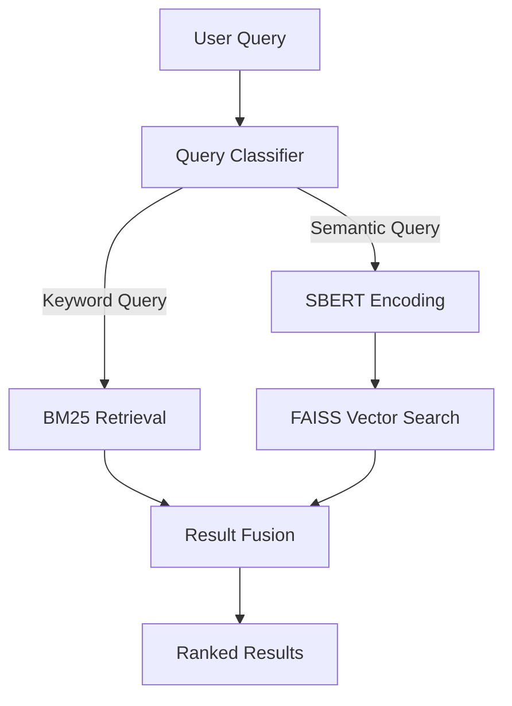

# Knowledge Transfer Document

**Last Updated**: March 25, 2025

## 1. Project Overview

This project is a high-performance social media short-text retrieval system that combines the advantages of semantic retrieval (SBERT) and keyword retrieval (BM25), achieving millisecond-level response through GPU-accelerated FAISS HNSW indexing.

### Key Metrics
- Latency: ≤0.02ms
- Throughput: 1,000 QPS (Peak 5,000 QPS)
- Accuracy: MRR@10 ≥ 0.72

## 2. System Architecture

### 2.1 Hybrid Retrieval Architecture


### 2.2 Key Technical Components
| Component | Technology | Optimization |
|-----------|------------|--------------|
| Semantic Encoding | SBERT(all-mpnet-base-v2) | FP16 Quantization |
| Vector Index | FAISS HNSW | IVF_PQ 4x Compression |
| Hybrid Ranking | Dynamic Weighting Algorithm | Bayesian Optimization |

## 3. Core Code Structure

### 3.1 Main Modules
```python
src/
├── bm25_retriever.py       # BM25 Implementation
├── dynamic_weighting.py    # Hybrid Weighting Algorithm
├── index_builder.py        # FAISS Index Construction
└── model_training.py       # SBERT Fine-tuning
```

### 3.2 Key Algorithm
```python
# Dynamic Weight Calculation
def calculate_weights(query):
    # Using Logistic Regression Classifier
    weights = classifier.predict(query)
    return weights['semantic'], weights['keyword']
```

## 4. Data Flow

1. **Data Preparation**:
   - MSMARCO Dataset
   - Twitter Domain Adaptation Data
   - STS Benchmark Evaluation Set

2. **Processing Pipeline**:
   ```mermaid
   graph LR
       A[Raw Data] --> B[Cleaning]
       B --> C[SBERT Encoding]
       C --> D[FAISS Indexing]
   ```

## 5. Operations Guide

### 5.1 Deployment Configuration
```yaml
resources:
  gpu: 1xA100
  memory: 32GB
  quantize: fp16
```

### 5.2 Monitoring Metrics
- Real-time QPS Monitoring
- 95th Percentile Latency
- GPU Memory Usage

## 6. Troubleshooting

| Symptom | Possible Cause | Solution |
|---------|---------------|----------|
| Increased Retrieval Latency | FAISS Index Fragmentation | Periodic Index Rebuilding |
| Inaccurate Semantic Matching | Domain Drift | Incremental SBERT Training |
| Insufficient Memory | Unquantized Vectors | Enable FP16 Mode |

## 7. Handover Checklist

- [ ] Complete Test Cases
- [ ] Performance Benchmark Report
- [ ] Operations Manual
- [ ] Emergency Contact List

## 8. Reference Resources

1. [FAISS Official Documentation](https://github.com/facebookresearch/faiss/wiki)
2. [SBERT Fine-tuning Guide](https://www.sbert.net/docs/training/overview.html)
3. Internal Project Documents:
   - `plan.md` - Technical Solution
   - `README.md` - Project Overview

